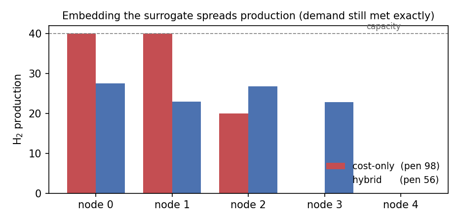

# Hsc-hybrid-demo

A five-node hydrogen-supply-chain siting problem where a **trained neural
surrogate is embedded directly inside an exact Gurobi MILP**. It's the runnable
prototype from Appendix A of *A Gurobi-Accelerated Hybrid AI–OR Framework for
Resilient Hydrogen Supply Chain Network Design*, the smallest version that
proves the seam holds.

## The idea

Designing a hydrogen network is three problems stacked together: **where to
build** (discrete, combinatorial), the **physics of storing and moving H₂**
(nonlinear), and **forecasting** supply/demand (uncertain). A mixed-integer
solver is excellent at the first and hands you guarantees; it stalls on the
other two. So we split the work by *what has to be guaranteed*:

- **The solver owns the guarantees**, mass balance, capacity, and the discrete
  build decisions. These are hard constraints; a neural net doesn't get to vote.
- **A learned model owns the nonlinear, messy part**, here, an operating
  penalty standing in for compression / boil-off stress and the fragility you
  get from piling all your production onto one or two nodes.

The seam between them is one line:

```python
add_predictor_constr(m, mlp, x.reshape(1, -1), pen)   # trained MLP -> MILP constraints
```

`gurobi-machinelearning` turns the trained ReLU network into piecewise-linear
constraints, so the solver optimises *against the surrogate* while still
enforcing mass balance and capacity exactly.

## What the model does

| Piece | Owner | Form |
|-------|-------|------|
| build / no-build per node (`y`) | solver | binary |
| production per node (`x`) | solver | `0 ≤ x ≤ cap·y` |
| mass balance | solver | `Σx = demand` (hard) |
| operating penalty | surrogate | `MLPRegressor` embedded via `add_predictor_constr` |
| objective | both | `capex·y + unit·x + λ·penalty` |

The "true" penalty being learned is `Σ xᵢ^2.5` — strictly convex per node, so
loading one node hard costs far more than spreading the same mass out. A small
MLP (`StandardScaler → MLPRegressor(32,16)`) learns it to R² ≈ 0.998, then goes
inside the solver.

## Run it

```bash
python -m venv .venv && source .venv/bin/activate
pip install -r requirements.txt
python hsc_demo.py
```

`gurobipy` ships with a size-limited license that is more than enough for this
model no Gurobi account needed.

## What you should see

Flip the surrogate on and the optimal plan changes, it stops concentrating and
spreads out, while still hitting demand exactly:

```
COST-ONLY  (solver alone, penalty ignored)
  production per node : [40. 40. 20.  0.  0.]
  nodes built         : 3
  true operating pen.  : 98.0

HYBRID     (trained surrogate embedded in Gurobi)
  production per node : [27.5 23.  26.7 22.8  0. ]
  nodes built         : 4
  true operating pen.  : 56.4

nodes: 3 -> 4   |   true penalty: 98 -> 56 (42% lower)   |   demand met exactly in both
```



The cost-only plan maxes the two cheapest nodes to capacity (40, 40) and tops up
a third — cheap on paper, fragile in practice. The hybrid plan builds a fourth
node and spreads ~25 across all four, cutting the true operating penalty ~42%
for a small bump in capital cost. **Both meet demand exactly** — the surrogate
never gets to bend mass balance, because that lives with the solver.

## Why it's built this way

Embedding a surrogate isn't free: every ReLU adds binary variables, so a big
network can blow up the very MILP you were trying to speed up. That's why the
surrogate here is small and does its real work offline; only a compact piece
goes inside the solver. Scaling up from this prototype is mostly substitution,
not redesign — swap the synthetic stand-in for a PyTorch GNN/PINN trained on
real data, keep the same seam.

## Files

- `hsc_demo.py` — the whole prototype (~130 lines incl. comments: data, surrogate, MILP, plot)
- `requirements.txt` — pinned dependencies
- `figure_a1.png` — generated on run
